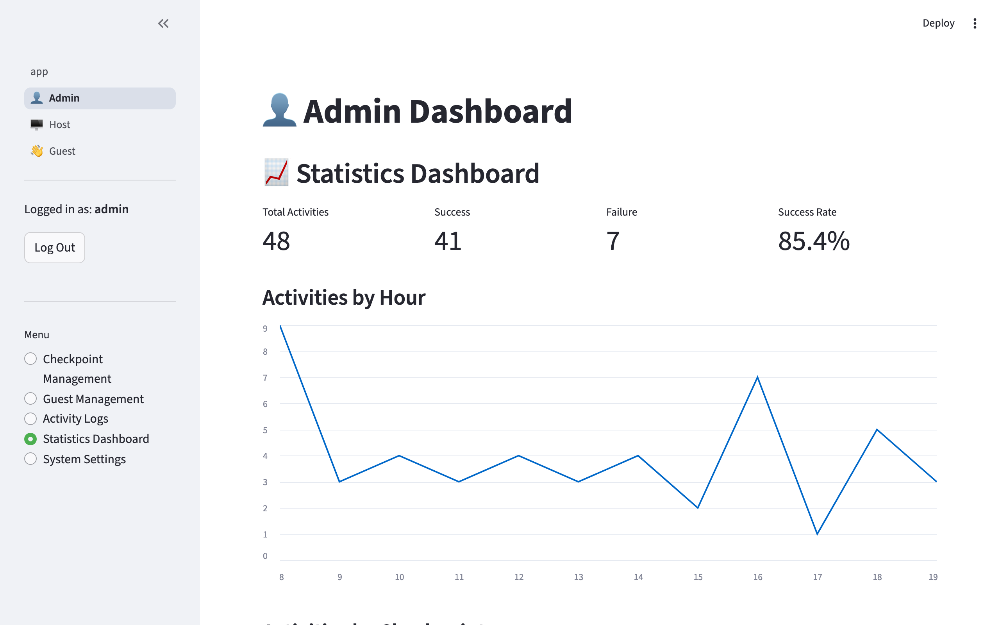
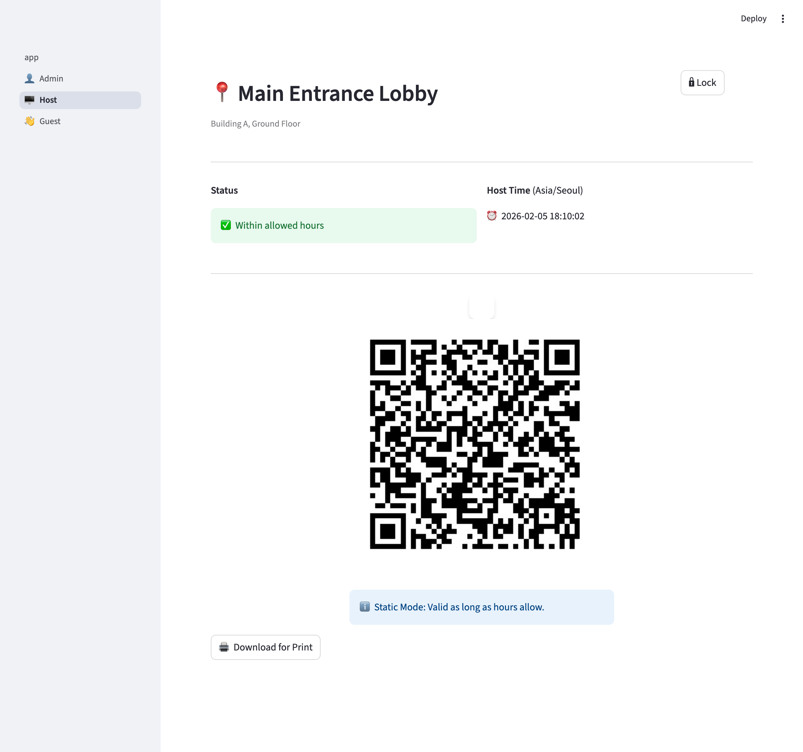
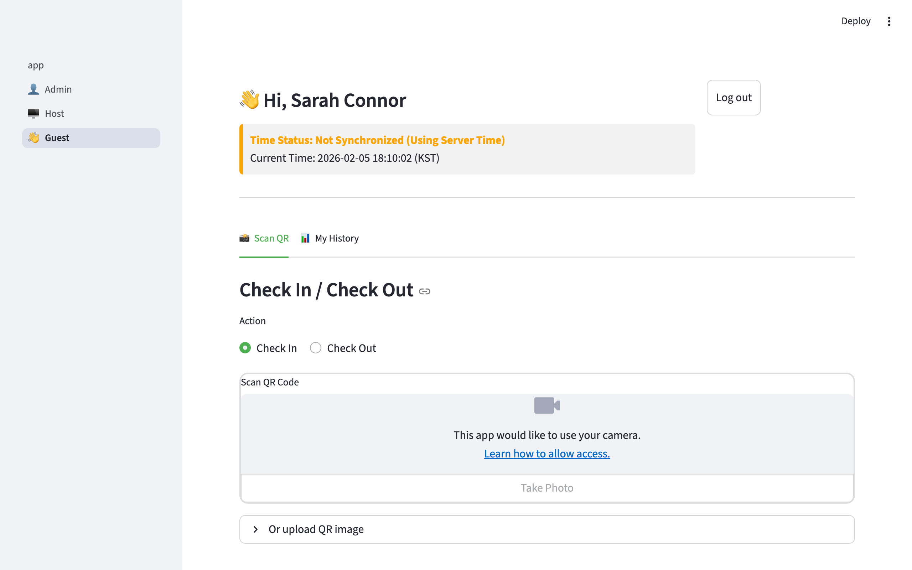
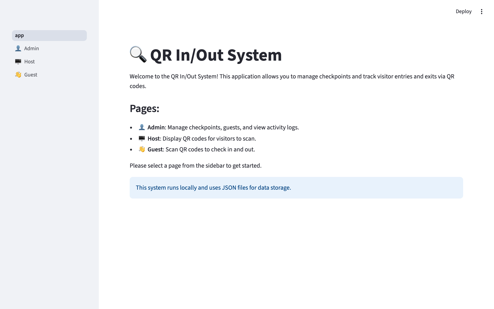
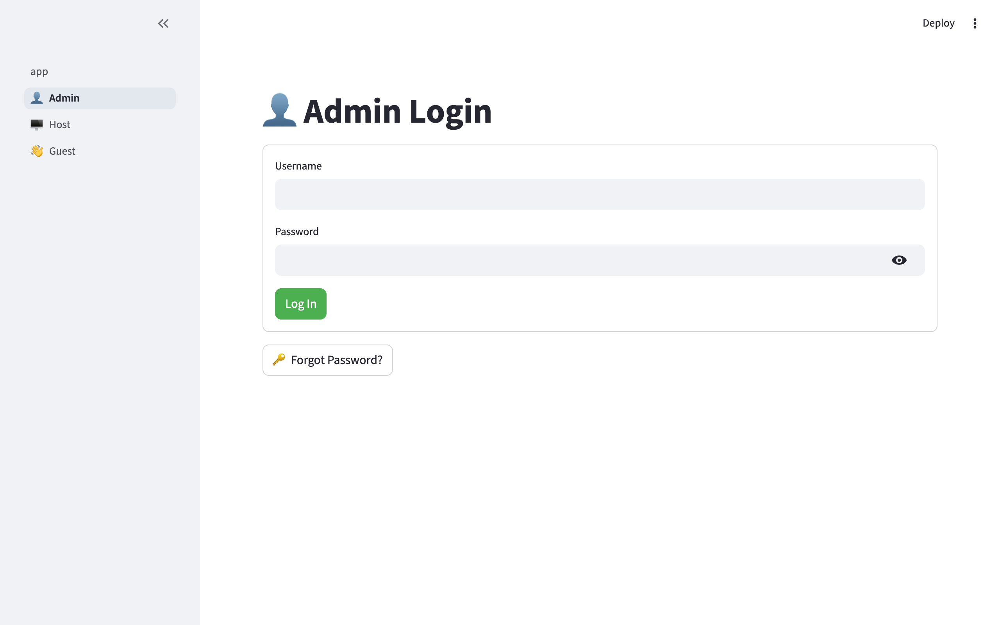
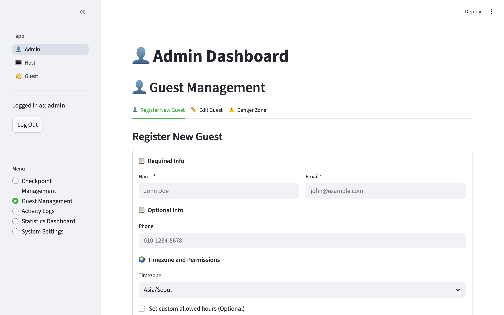
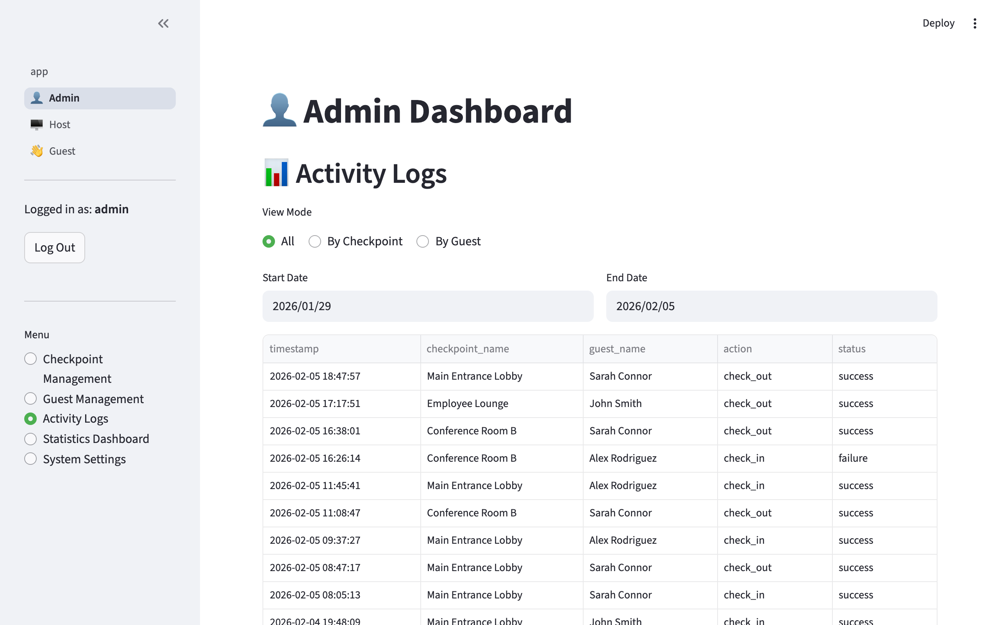
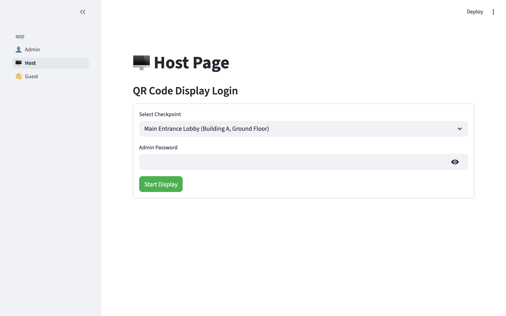
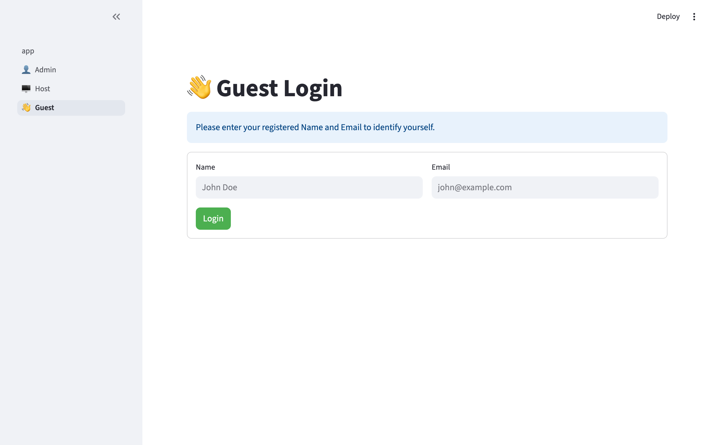
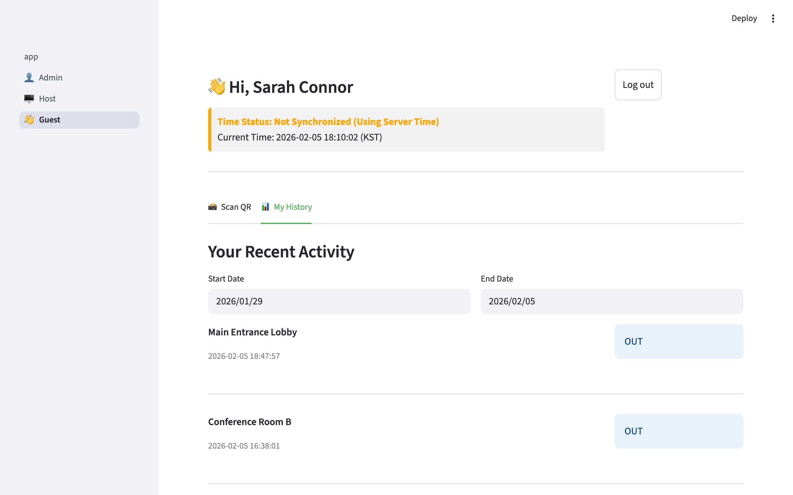

# QR In/Out - QR Code-Based Checkpoint Access Management System

[](https://github.com/jakeleekr13-otter/qr_in_out/stargazers)
[](https://github.com/sponsors/jakeleekr13-otter)
[](https://www.python.org/)
[](https://streamlit.io/)
[](LICENSE)

[한국어 문서](README.ko.md) | **English**

<table>
  <tr>
    <td></td>
    <td></td>
    <td></td>
  </tr>
  <tr>
    <td align="center"><b>Admin Dashboard</b></td>
    <td align="center"><b>Host QR Display</b></td>
    <td align="center"><b>Guest Check-In</b></td>
  </tr>
</table>

---

## Overview

**QR In/Out** is a comprehensive QR code-based checkpoint access management system built with Python and Streamlit. It enables organizations to deploy static or dynamic QR codes at designated checkpoints, allowing authorized visitors to check in and out by scanning codes via their mobile devices.

### Key Features

- **Three Role-Based Pages**
  - **Admin**: Manage checkpoints, guests, view activity logs, and configure system settings
  - **Host**: Display QR codes (static or dynamic) at checkpoint locations
  - **Guest**: Scan QR codes to check in/out, view personal visit history

- **Dual QR Code Modes**
  - **Static QR**: Never expires, suitable for printable signage
  - **Dynamic QR**: Auto-refreshes every 30 minutes with HMAC-SHA256 signatures for enhanced security

- **Time-Based Access Control**
  - Checkpoint-specific allowed hours
  - Guest-specific allowed hours (optional)
  - Timezone-aware validation using World Time API
  - Overnight shift support (e.g., 22:00 - 06:00)

- **Security Features**
  - bcrypt password hashing for admin and checkpoint access
  - HMAC-SHA256 signatures for dynamic QR codes
  - Sequence number validation to prevent replay attacks
  - Time synchronization via World Time API to prevent local time manipulation
  - Soft delete mechanism to preserve data history

- **Local Data Storage**
  - JSON-based storage (no external database required)
  - Thread-safe concurrent access
  - Offline operation capability
  - Activity log persistence

---

## Screenshots

<details>
<summary><b>Click to view all screenshots</b></summary>

### Home


### Admin
| Admin Login | Checkpoint Management |
|---|---|
|  |  |

| Guest Management | Activity Logs |
|---|---|
|  |  |

| Statistics Dashboard |
|---|
|  |

### Host
| Host Login | QR Code Display |
|---|---|
|  |  |

### Guest
| Guest Login | QR Scan |
|---|---|
|  |  |

| Visit History |
|---|
|  |

</details>

---

## Technology Stack

- **Framework**: Streamlit (Python web framework)
- **QR Generation**: qrcode, Pillow
- **QR Scanning**: pyzbar (requires zbar system library)
- **Time Synchronization**: World Time API, TimeAPI.io
- **Authentication**: bcrypt password hashing with salt
- **Data Storage**: JSON files with thread-safe locks
- **Timezone Handling**: pytz
- **Environment Management**: python-dotenv

---

## Installation

### Option A: Install via pip (Recommended)

```bash
pip install qr-in-out
```

### Option B: Install from source

```bash
git clone https://github.com/jakeleekr13-otter/qr_in_out.git
cd qr_in_out
pip install -r requirements.txt
```

### System Dependencies (QR Scanning)

The `pyzbar` library requires the `zbar` shared library:

**macOS (Homebrew):**
```bash
brew install zbar
```

**Ubuntu / Debian:**
```bash
sudo apt-get install libzbar0
```

**Windows:**
Usually `pip install pyzbar` includes necessary DLLs. If issues occur, install [Visual C++ Redistributable Packages](https://support.microsoft.com/en-us/help/2977003/the-latest-supported-visual-c-downloads).

### Environment Setup

```bash
cp .env.example .env
# Edit .env and set QR_SECRET_KEY (min 32 characters)
# Generate a key: python -c "import secrets; print(secrets.token_hex(32))"
```

### Run

```bash
streamlit run app.py
```

The application will open at `http://localhost:8501`

---

## Quick Start Guide

### Step 1: Admin Setup

1. Navigate to **👤 Admin** page
2. First-time login uses default credentials (you'll be prompted to change password):
   - Username: `admin`
   - Password: `admin`
3. **IMPORTANT**: Change the default password immediately

### Step 2: Create Checkpoint

1. In Admin page, go to **Create Checkpoint** section
2. Fill in checkpoint details:
   - Name (e.g., "Main Entrance")
   - Location (e.g., "Building A, 1F")
   - Allowed Hours (e.g., 09:00 - 18:00)
   - QR Mode: **Static** (printable) or **Dynamic** (auto-refresh)
   - Admin Password (for Host page access)
3. Select which guests are allowed to access this checkpoint
4. Click **Create Checkpoint**

### Step 3: Register Guests

1. Go to **Guest Management** section
2. Click **Register New Guest**
3. Enter guest information:
   - Name (required)
   - Email (required)
   - Phone (optional)
   - Timezone (e.g., Asia/Seoul)
   - Allowed Checkpoints
   - Custom Allowed Hours (optional)
4. Click **Register Guest**

### Step 4: Display QR Code (Host)

1. Navigate to **🖥️ Host** page
2. Select a checkpoint from dropdown
3. Enter checkpoint's admin password
4. QR code will be displayed:
   - **Static QR**: Download and print for permanent display
   - **Dynamic QR**: Keep browser open; refreshes automatically every 30 minutes

### Step 5: Guest Check-In/Out

1. Navigate to **👋 Guest** page
2. Enter **Name** and **Email** to authenticate
3. Choose action: **Check In** or **Check Out**
4. Scan QR code using:
   - **Camera** (mobile devices)
   - **Upload QR Image** (screenshot or file)
5. System validates and logs activity
6. View personal visit history in **My Visit History** section

---

## Usage Examples

### Scenario 1: Office Building Access

**Setup:**
- Create checkpoint: "Main Entrance"
- Allowed hours: 08:00 - 20:00
- QR mode: Dynamic (security)
- Register employees as guests

**Daily Use:**
- Host displays dynamic QR code on monitor at entrance
- Employees scan QR code to check in when arriving (08:30)
- Employees scan again to check out when leaving (18:15)
- Admin monitors real-time activity logs

---

### Scenario 2: Event Registration

**Setup:**
- Create checkpoint: "Conference Registration Desk"
- Allowed hours: 09:00 - 18:00
- QR mode: Static (printable)
- Register event attendees as guests

**Event Day:**
- Print static QR code and place at registration desk
- Attendees scan QR code upon arrival
- Staff monitors check-in status via Admin dashboard
- Export activity logs to CSV for attendance records

---

### Scenario 3: Multi-Site Facility Management

**Setup:**
- Create checkpoints for each building (A, B, C, D)
- Different allowed hours per building
- Assign specific guests to specific buildings
- Guest-level time restrictions for contractors

**Operations:**
- Each building displays its own QR code (static or dynamic)
- Guests can only access authorized buildings
- Contractor access automatically restricted to assigned hours
- Activity logs track all cross-building movements

---

## System Architecture

```
qr_in_out/
├── app.py                  # Main Streamlit entry point
├── pages/
│   ├── 1_👤_Admin.py      # Admin management interface
│   ├── 2_🖥️_Host.py       # QR code display page
│   └── 3_👋_Guest.py      # Guest check-in/out page
├── core/
│   ├── models.py           # Data models (Checkpoint, Guest, ActivityLog)
│   ├── storage.py          # JSON storage with thread-safe operations
│   ├── auth.py             # Authentication and password hashing
│   ├── qr_manager.py       # QR generation, validation, signatures
│   ├── time_service.py     # Time synchronization via World Time API
│   └── time_validator.py   # Time-based access control validation
├── utils/
│   └── helpers.py          # Utility functions (email validation, lookups)
├── data/                   # JSON storage files (auto-created)
│   ├── checkpoints.json
│   ├── guests.json
│   ├── activity_logs.json
│   └── admin_settings.json
├── docs/                   # Documentation and planning artifacts
│   └── planning-artifacts/
│       ├── PRD-Overview.md
│       ├── PRD-Admin.md
│       ├── PRD-Host.md
│       └── PRD-Guest.md
├── requirements.txt        # Python dependencies
└── README.md              # This file
```

---

## Security Considerations

### Current Security Measures

- Password hashing for admin and checkpoint access
- HMAC-SHA256 signatures on dynamic QR codes
- Sequence number validation to prevent replay attacks
- Time synchronization to prevent local time manipulation
- Soft delete mechanism (data preservation)
- Thread-safe concurrent storage access

### ⚠️ Security Warnings

**BEFORE PRODUCTION DEPLOYMENT:**

✅ **Fixed in v1.0**: Password hashing upgraded to bcrypt
✅ **Fixed in v1.0**: SECRET_KEY moved to environment variable
✅ **Fixed in v1.0**: Deleted guest authentication bypass patched

**Still Required:**

1. **Environment Configuration**: Set `QR_SECRET_KEY` in `.env` file:
   ```bash
   # Copy .env.example to .env and set your secret key
   cp .env.example .env
   # Edit .env and set QR_SECRET_KEY to a secure random value
   ```

2. **Default Credentials**: Change default admin password on first login (prompted automatically)

3. **HTTPS**: Deploy with HTTPS in production (Streamlit supports via reverse proxy)

4. **Data Encryption**: Consider encrypting sensitive data at rest for highly sensitive deployments

5. **File Permissions**: Ensure `data/` directory has restricted permissions (0700)

See [SECURITY.md](docs/SECURITY.md) for detailed security analysis and additional recommendations.

---

## Configuration

### System Settings (Admin Page)

- **Admin Timezone**: Default timezone for admin operations
- **Default Guest Timezone**: Default timezone for new guests
- **QR Refresh Interval**: Dynamic QR refresh period (default: 1800 seconds / 30 minutes)
- **Require Time Sync**: Enforce time synchronization via World Time API

### Environment Variables

Create `.env` file (not committed to git):

```env
QR_SECRET_KEY=your-secure-random-key-here-min-32-chars
STREAMLIT_SERVER_PORT=8501
```

---

## Data Models

### Checkpoint
```python
{
  "id": "uuid",
  "name": "Main Entrance",
  "location": "Building A, 1F",
  "allowed_hours": {"start_time": "09:00", "end_time": "18:00"},
  "qr_mode": "static" | "dynamic",
  "admin_password_hash": "hashed_password",
  "allowed_guests": ["guest_id_1", "guest_id_2"],
  "current_qr_sequence": 0,
  "deleted_at": null,
  "created_at": "2026-02-05T10:00:00Z",
  "updated_at": "2026-02-05T10:00:00Z"
}
```

### Guest
```python
{
  "id": "uuid",
  "name": "John Doe",
  "email": "john@example.com",
  "phone": "+1-555-0100",
  "timezone": "America/New_York",
  "allowed_checkpoints": ["checkpoint_id_1"],
  "allowed_hours": {"start_time": "08:00", "end_time": "20:00"},
  "deleted_at": null,
  "created_at": "2026-02-05T10:00:00Z",
  "updated_at": "2026-02-05T10:00:00Z"
}
```

### Activity Log
```python
{
  "id": "uuid",
  "timestamp": "2026-02-05T14:30:00Z",
  "checkpoint_id": "checkpoint_uuid",
  "guest_id": "guest_uuid",
  "action": "check_in" | "check_out",
  "qr_code_used": "{...qr_content...}",
  "status": "success" | "failure",
  "failure_reason": null | "error message",
  "metadata": {"scanned_at": "2026-02-05T14:30:00Z"}
}
```

---

## API Reference

### Core Modules

#### TimeService
```python
TimeService.get_current_time(timezone_str: str) -> Tuple[datetime, bool]
# Returns: (current_time, is_synchronized)
# Sources: World Time API → TimeAPI.io → Local system time
```

#### QRManager
```python
QRManager.generate_static_qr_content(checkpoint_id: str) -> str
QRManager.generate_dynamic_qr_content(checkpoint_id, sequence, issued_at, expires_at) -> str
QRManager.verify_signature(qr_content: Dict) -> bool
QRManager.is_qr_expired(qr_content: Dict, current_time: datetime) -> bool
```

#### AuthManager
```python
AuthManager.hash_password(password: str) -> str
AuthManager.verify_password(password: str, password_hash: str) -> bool
```

---

## Troubleshooting

### Common Issues

**1. "pyzbar library is not available" Error**

**Cause**: `zbar` system library not installed

**Solution**: Install system dependency:
```bash
# macOS
brew install zbar

# Ubuntu/Debian
sudo apt-get install libzbar0
```

---

**2. Time Synchronization Failures**

**Symptoms**: "Not Synchronized (Using Server Time)" warning

**Causes**:
- No internet connection
- World Time API unavailable
- Firewall blocking API requests

**Solution**:
- Check internet connection
- Verify firewall allows HTTP/HTTPS to `worldtimeapi.org` and `timeapi.io`
- System will fall back to local time with warning

---

**3. QR Code Scan Fails with "Invalid Signature"**

**Cause**: SECRET_KEY mismatch or QR code tampering

**Solution**:
- Ensure SECRET_KEY is consistent across all components
- Regenerate QR code from Host page
- Do not manually edit QR code content

---

**4. Guest Cannot Authenticate**

**Causes**:
- Email/name mismatch (check case sensitivity)
- Guest deleted (soft delete)
- Typos in email or name

**Solution**:
- Verify exact spelling of name and email
- Check Admin page to confirm guest is active (not deleted)
- Email is case-insensitive but must match exactly

---

**5. Access Denied During Allowed Hours**

**Causes**:
- Checkpoint allowed hours restriction
- Guest-specific allowed hours restriction
- Timezone mismatch

**Solution**:
- Check both checkpoint AND guest allowed hours
- Verify guest's timezone setting matches their actual location
- Ensure current time is within BOTH time windows

---

## Contributing

We welcome contributions! Please follow these guidelines:

1. **Fork** the repository
2. **Create a branch** for your feature (`git checkout -b feature/amazing-feature`)
3. **Commit** your changes (`git commit -m 'Add amazing feature'`)
4. **Push** to the branch (`git push origin feature/amazing-feature`)
5. **Open a Pull Request**

### Development Setup

```bash
# Clone your fork
git clone https://github.com/jakeleekr13-otter/qr_in_out.git
cd qr-in-out

# Create virtual environment
python -m venv venv
source venv/bin/activate  # On Windows: venv\Scripts\activate

# Install dependencies
pip install -r requirements.txt

# Run tests (when available)
pytest

# Run application
streamlit run app.py
```

### Code Style

- Follow PEP 8 guidelines
- Use type hints where applicable
- Add docstrings to all public functions
- Write unit tests for new features

---

## Roadmap

### Planned Features

- [x] **Enhanced Security**: bcrypt password hashing (completed in v1.0)
- [ ] **Multi-Language Support**: Internationalization (i18n)
- [ ] **Database Backend**: PostgreSQL/MySQL option for larger deployments
- [ ] **Email Notifications**: Alert guests on check-in/out
- [ ] **Mobile App**: Native iOS/Android companion app
- [ ] **API Endpoints**: REST API for third-party integrations
- [ ] **Analytics Dashboard**: Advanced reporting and visualizations
- [ ] **Role-Based Access Control**: Granular permissions for admin users
- [ ] **Audit Logs**: Comprehensive admin action logging
- [ ] **Backup/Restore**: Automated data backup functionality

---

## License

This project is licensed under the MIT License - see the [LICENSE](LICENSE) file for details.

---

## Acknowledgments

- Built with [Streamlit](https://streamlit.io/)
- QR code generation powered by [qrcode](https://pypi.org/project/qrcode/)
- QR code scanning powered by [pyzbar](https://pypi.org/project/pyzbar/)
- Time synchronization via [World Time API](http://worldtimeapi.org/) and [TimeAPI.io](https://timeapi.io/)
- Timezone handling by [pytz](https://pypi.org/project/pytz/)

---

## Support

- **Documentation**: [docs/](docs/)
- **Issues**: [GitHub Issues](https://github.com/jakeleekr13-otter/qr_in_out/issues)
- **Discussions**: [GitHub Discussions](https://github.com/jakeleekr13-otter/qr_in_out/discussions)

---

## 💖 Support

If you find this tool useful, please consider supporting development!

- ⭐ **Star this repo**: It helps a lot!
- 💖 **Sponsor me on GitHub**: [https://github.com/sponsors/jakeleekr13-otter](https://github.com/sponsors/jakeleekr13-otter)
- ☕ **Buy Me a Coffee**: [https://buymeacoffee.com/jakeleekr13otter](https://buymeacoffee.com/jakeleekr13otter)

Your support helps improve and maintain this project.

---

## Disclaimer

This software is provided "as-is" without warranty. Please review security considerations before deploying in production environments. The default configuration is intended for development and testing purposes.

---

**Made with ❤️ using Python and Streamlit**
